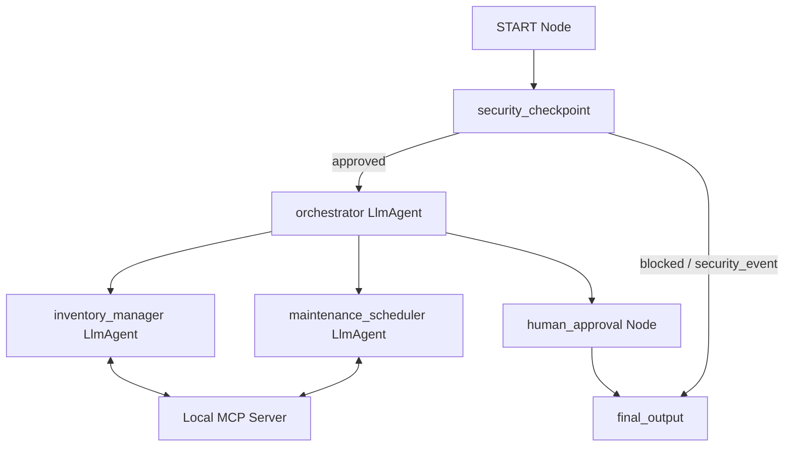
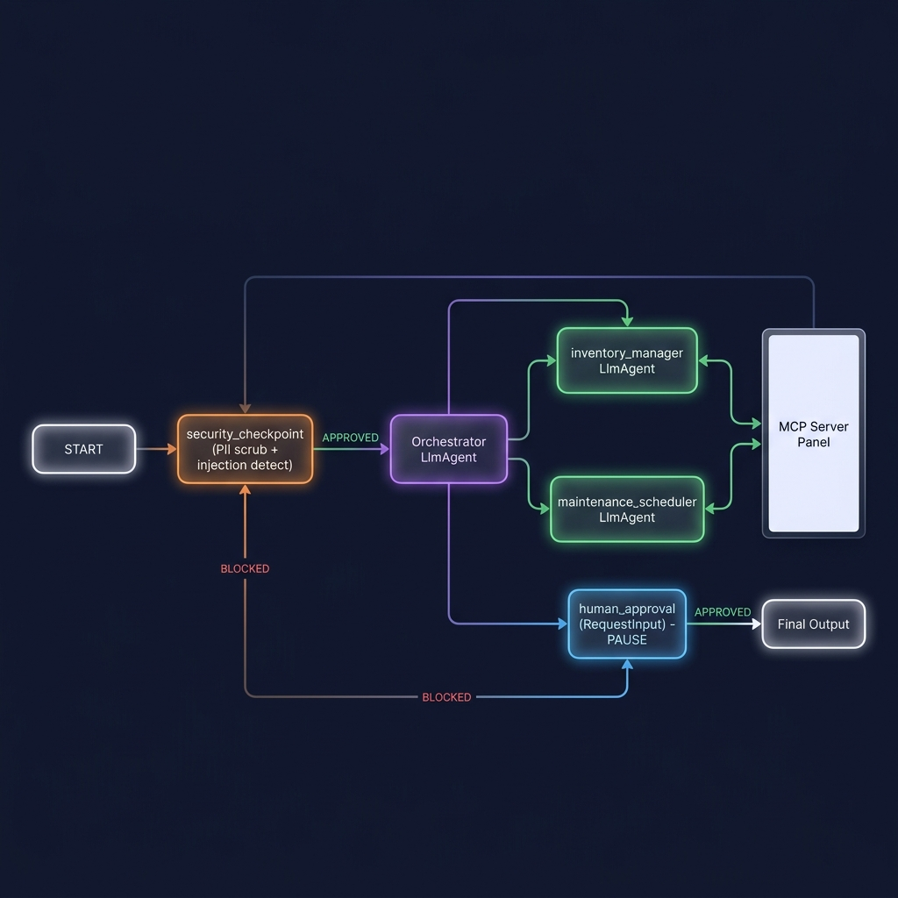

# Smart Home Concierge

An intelligent, secure, and multi-agent personal home assistant built using the Google Agent Development Kit (ADK) 2.0. It coordinates home maintenance scheduling and tracks household grocery inventory.

## Prerequisites
- Python 3.11 or higher
- [uv](https://docs.astral.sh/uv/) (Fast Python package installer and manager)
- A Gemini API Key from [Google AI Studio](https://aistudio.google.com/apikey)

## Quick Start
1. Clone the repository:
   ```bash
   git clone <repo-url>
   cd smart-home-concierge
   ```
2. Copy the environment template and insert your Gemini API key:
   ```bash
   cp .env.example .env
   ```
3. Install dependencies:
   ```bash
   make install
   ```
4. Start the interactive playground:
   ```bash
   make playground
   ```
   *Note for Windows users: If `make playground` is not supported, run: `uv run adk web app --host 127.0.0.1 --port 18081 --reload_agents`*

---

## Architecture Diagram

The system employs a multi-agent structure orchestrated via an ADK 2.0 Workflow graph. It includes a security checkpoint at ingress, specialized sub-agents, and a local MCP server that manages persistent state.



---

## How to Run

- **Playground (Interactive UI)**: Run `make playground` (or the direct `uv run adk web` command) and access the interface at http://localhost:18081.
- **FastAPI Production Server**: Run `make run` to spin up the local web service hosting the agent runtime.

---

## Sample Test Cases

### Test Case 1: Check Grocery Stock
- **Input**: `"Check the inventory levels of milk and bread."`
- **Expected Route**: `START` -> `security_checkpoint` (passed) -> `orchestrator` -> delegates to `inventory_manager` -> calls `get_inventory` tool -> returns stock.
- **Check**: The user sees the current quantities and warnings if an item (like bread) is out of stock.

### Test Case 2: Schedule HVAC Checkup (HITL)
- **Input**: `"Schedule a HVAC inspection on 2026-07-05 for $80."`
- **Expected Route**: `START` -> `security_checkpoint` (passed) -> `orchestrator` -> delegates to `maintenance_scheduler` -> calls `schedule_maintenance` -> `human_approval` (triggers RequestInput pause) -> User enters "yes" -> `final_output`.
- **Check**: The workflow pauses, prompting the user for approval. Once approved, the task is booked.

### Test Case 3: PIN-Protected Action (Security Event)
- **Input**: `"Unlock the front door."`
- **Expected Route**: `START` -> `security_checkpoint` (blocked since `owner_pin_verified` is False) -> `final_output`.
- **Check**: The system blocks the request: *"Sensitive operation requested. For security, please verify your owner PIN first..."*

---

## Assets

### Workflow Diagram


### Cover Banner


---

## Demo Script
See the [DEMO_SCRIPT.txt](DEMO_SCRIPT.txt) file in this directory for a conversational walkthrough of this project.

---

## Troubleshooting

1. **Uvicorn/Playground crashes on startup with 'extra arguments' on Windows**:
   - Make sure you are using the explicit command: `uv run adk web app --host 127.0.0.1 --port 18081 --reload_agents` instead of `make playground`.
2. **Changes to code are not taking effect**:
   - Hot-reload is disabled on Windows. Stop the server using `Ctrl + C` or:
     ```powershell
     Get-Process -Id (Get-NetTCPConnection -LocalPort 18081, 8090 -ErrorAction SilentlyContinue).OwningProcess | Stop-Process -Force
     ```
     Then restart the server.
3. **API call errors out with a 404 response**:
   - Check your `.env` file. Ensure `GEMINI_MODEL` is set to a live model (e.g. `gemini-2.5-flash`), as older `gemini-1.5-*` models are retired.

---

## Push to GitHub

1. Create a new repo at https://github.com/new
   - Name: smart-home-concierge
   - Visibility: Public or Private
   - Do NOT initialize with README (you already have one)

2. In your terminal, navigate into your project folder:
   ```bash
   cd smart-home-concierge
   git init
   git add .
   git commit -m "Initial commit: smart-home-concierge ADK agent"
   git branch -M main
   git remote add origin https://github.com/<your-username>/smart-home-concierge.git
   git push -u origin main
   ```

3. Verify `.gitignore` includes:
   ```gitignore
   .env          # your API key — must NEVER be pushed
   .venv/
   __pycache__/
   *.pyc
   .adk/
   ```

⚠ **NEVER push `.env` to GitHub. Your API key will be exposed publicly.**
