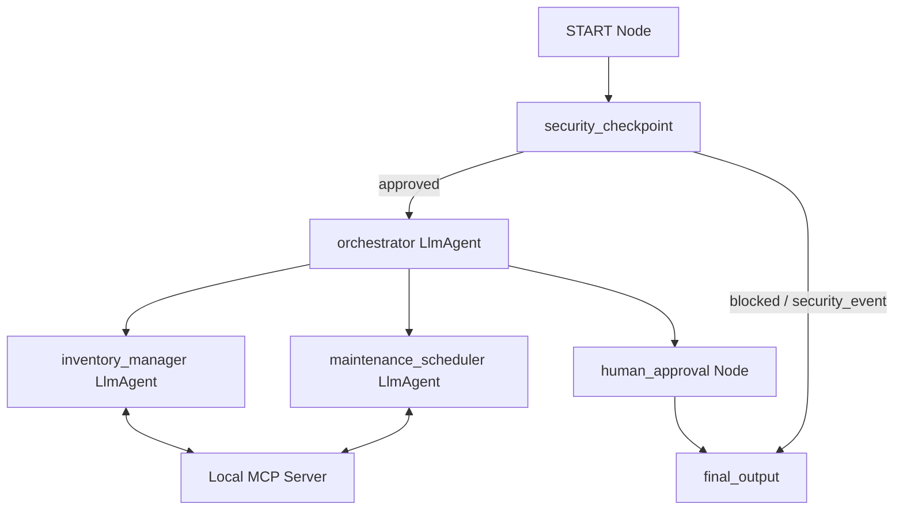

# Submission Write-Up: Smart Home Concierge

## Problem Statement
Homeowners face significant cognitive load when managing daily tasks. Balancing grocery lists, tracking home consumables (e.g. eggs, toilet paper, detergent), and coordinating household maintenance tasks (e.g. HVAC filters, gutter cleanings, leak repairs) is fragmented across different apps. Furthermore, exposing home controls and schedules to automation poses prompt injection, PII leak, and physical safety risks (like unauthorized door unlocking). 

The **Smart Home Concierge** resolves this by providing a unified, natural language interface that handles inventory management, coordinates cleaning schedules, and enforces a high-security perimeter.

---

## Solution Architecture
The concierge is structured as a multi-agent system implemented via a graph-based workflow.

---

## Concepts Used

- **ADK 2.0 Workflow**: Built using graph-based routing in [agent.py](file:///c:/Users/deepi/OneDrive/Desktop/adk-workspace/smart-home-concierge/app/agent.py#L198-L224).
- **LlmAgent**: Used for specialized sub-agents (`inventory_manager` and `maintenance_scheduler`) in [agent.py](file:///c:/Users/deepi/OneDrive/Desktop/adk-workspace/smart-home-concierge/app/agent.py#L38-L58).
- **AgentTool**: Incorporated to allow the `orchestrator` to delegate tasks to sub-agents in [agent.py](file:///c:/Users/deepi/OneDrive/Desktop/adk-workspace/smart-home-concierge/app/agent.py#L60-L75).
- **MCP Server**: Designed to expose domain-specific tools via `FastMCP` in [mcp_server.py](file:///c:/Users/deepi/OneDrive/Desktop/adk-workspace/smart-home-concierge/app/mcp_server.py).
- **Security Checkpoint**: Implemented as a guardrail function node in [agent.py](file:///c:/Users/deepi/OneDrive/Desktop/adk-workspace/smart-home-concierge/app/agent.py#L77-L157).
- **Agents CLI**: Scaffolding, environments, and playground launched via `agents-cli` tool.

---

## Security Design
Security is enforced at ingress in the `security_checkpoint` node:
1. **PII Scrubbing**: Regex filters automatically scrub credit card numbers and phone numbers to prevent LLM logging leaks.
2. **Prompt Injection Mitigation**: Restricts keywords like "ignore previous instructions" or "system prompt" to neutralize prompt injection attacks.
3. **Audit Logging**: Emits structured JSON audit logs detailing each transaction and threat category.
4. **Physical Authorization Enforcer (Domain-Specific Rule)**: High-security tasks like "unlock front door" or "disable alarm" are blocked unless the user provides the correct PIN (`1234`), which validates their session.

---

## MCP Server Design
Exposes 5 local tools in [mcp_server.py](file:///c:/Users/deepi/OneDrive/Desktop/adk-workspace/smart-home-concierge/app/mcp_server.py) representing the core state:
- `get_inventory`: Fetches stock levels of grocery items.
- `update_inventory`: Modifies consumables counts.
- `get_maintenance_tasks`: Retrieves due dates and costs of repairs.
- `schedule_maintenance`: Schedules new tasks.
- `verify_owner_pin`: Validates the PIN for physical authorization.

---

## Human-in-the-Loop (HITL) Flow
Any schedule change or inventory ordering triggers a pause via the `human_approval` node. By yielding `RequestInput`, the system halts execution until the user manually types "yes" or "no". This protects users from accidental purchases or unwanted appointments.

---

## Demo Walkthrough
Refer to the three test cases in [README.md](file:///c:/Users/deepi/OneDrive/Desktop/adk-workspace/smart-home-concierge/README.md#L41-L60) to walk through the main flows:
- **Inventory Check**: Demonstrates sub-agent tool calling.
- **Maintenance Scheduling**: Showcases the HITL flow.
- **PIN Authorization**: Illustrates the security checkpoint blocking physical commands.

---

## Impact / Value Statement
The Smart Home Concierge reduces the administrative burden of home-running. Families benefit from proactive reminders about low groceries or pending repairs, while the secure architecture ensures that connected smart homes remain safe from malicious exploitation.
